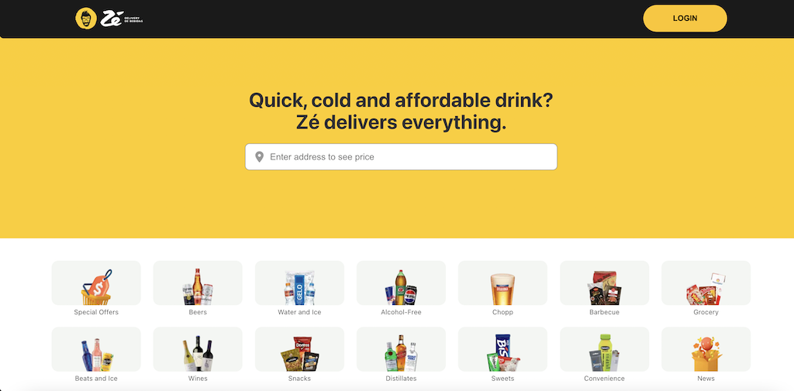
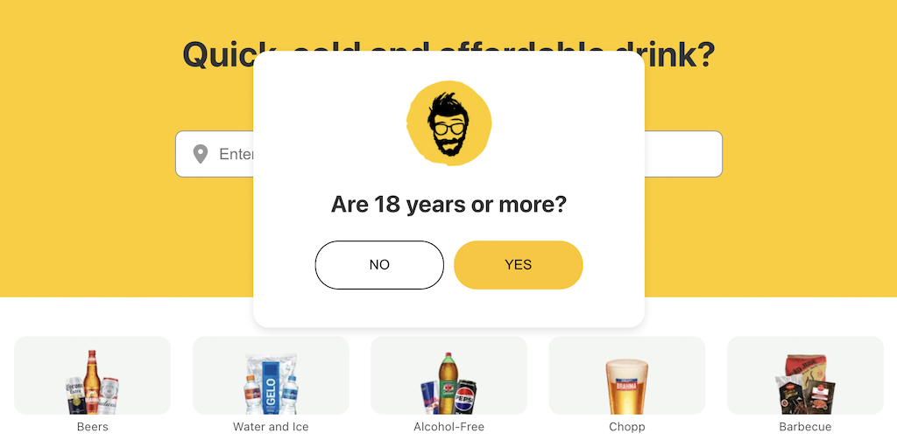
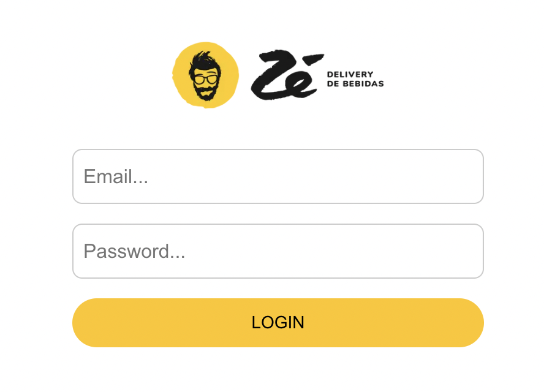

# M2S08

## Exercises using React + Vite: 

Another week full of exercises with Vite and React to practice routes using react-router-dom. This time the inspiration came from <a href="https://www.ze.delivery/">Zé Delivery</a> website.

### Technologies

- HTML
- CSS
- JavaScript
- React

---

### Samples

#### Home
<h4 align="center"></4>

#### Modal
<h4 align="center"></h4>

#### Login
<h4 align="center"></h4>